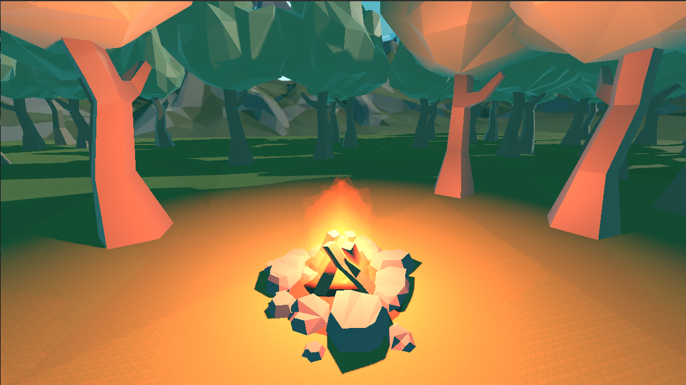

# Hiking

Hiking is just a prototype walking simulator game thing made with Godot, I'm prototyping the walking and interactions and also trying out different level design ideas.
I wanted to also document my progress in learning game development with Godot.

## Installation

While there isn't a release in here yet, I plan to add one after I add a puzzle or two and maybe flesh out the level a bit. For now I'm just slowly chipping away and learning how to use Github with Godot.
There will also be a release on my [itch](https://unkeptroadrash.itch.io/) and while it's empty right now, I hope to actually release something somewhere someday.

## Thanks

If you made it this far, thanks for checking this out, I'm really stoked about it.
